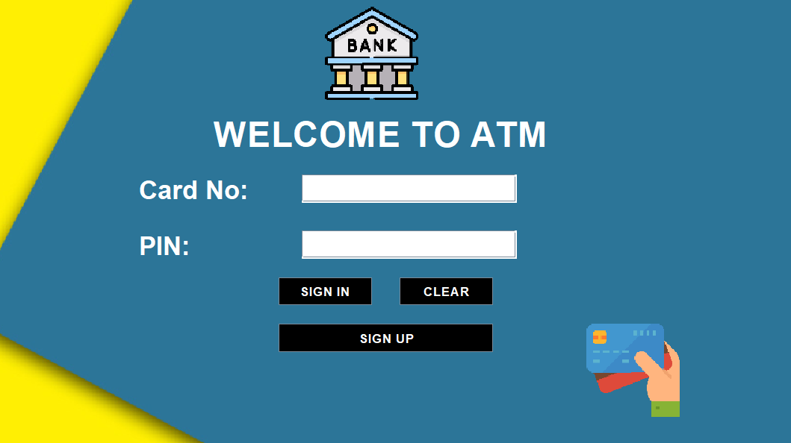
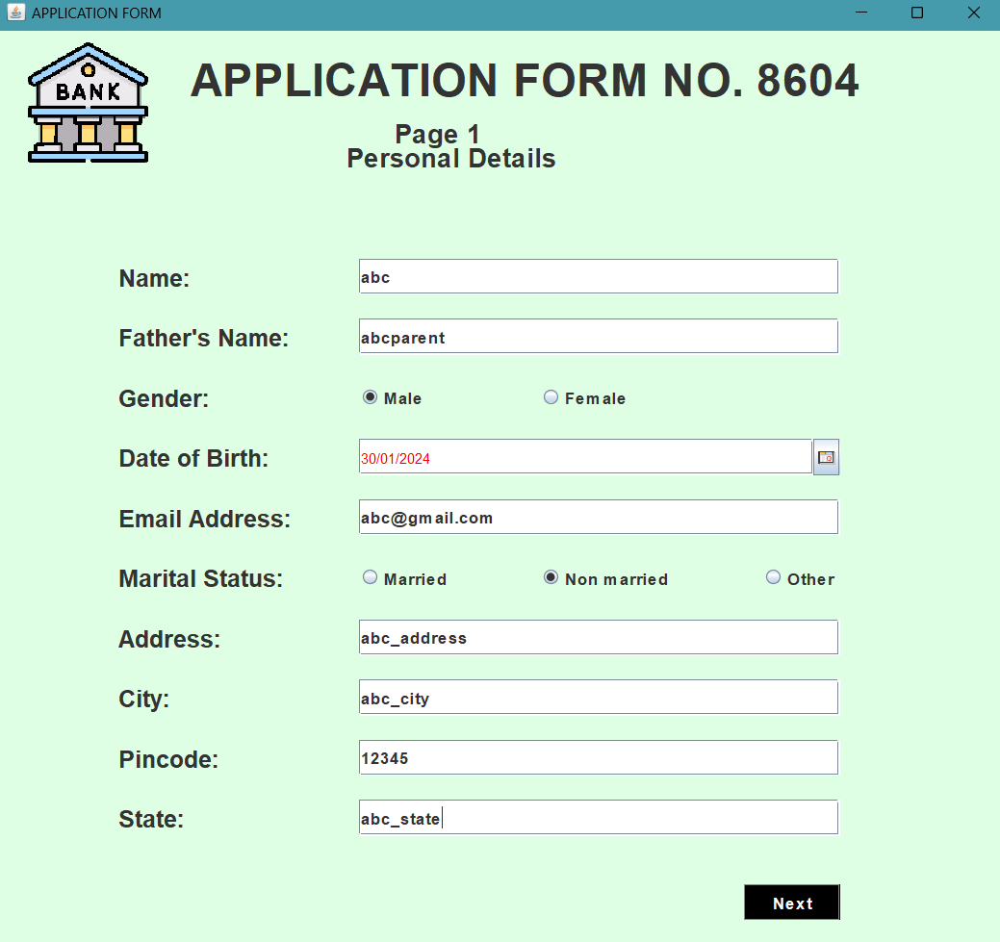
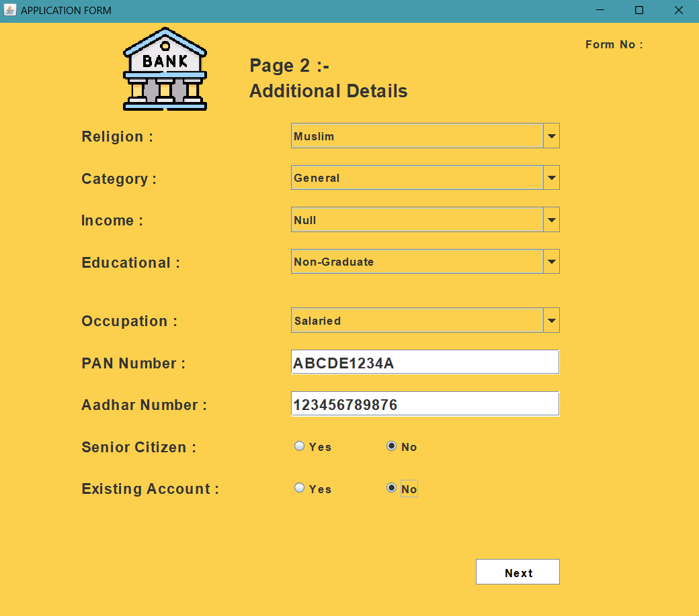
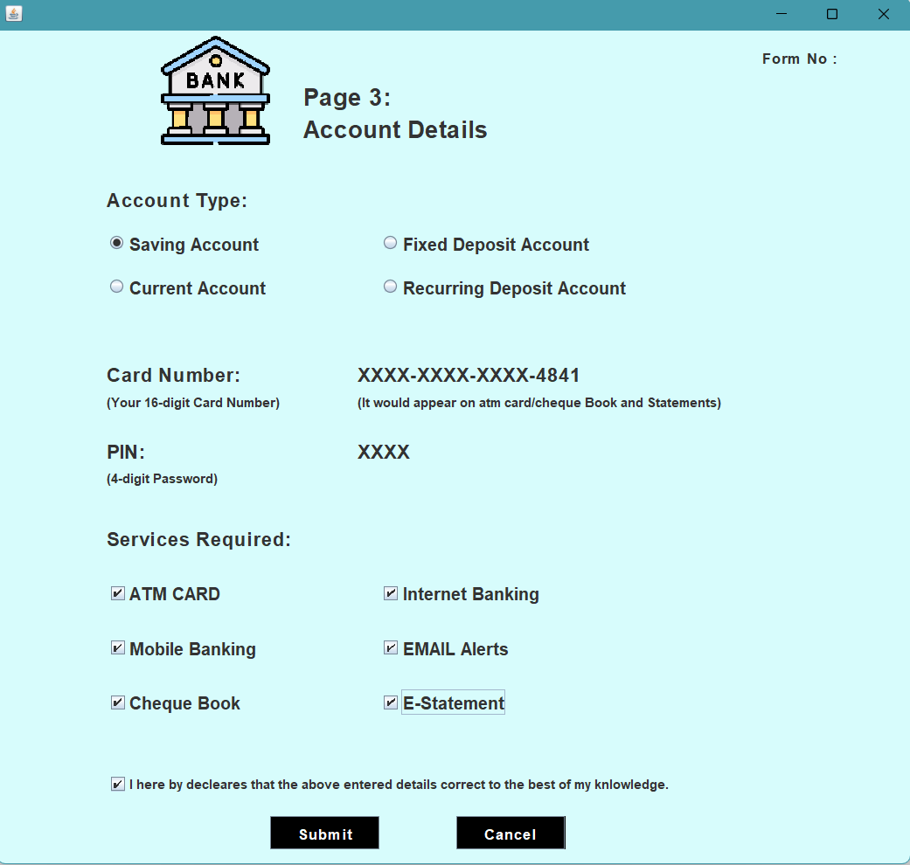
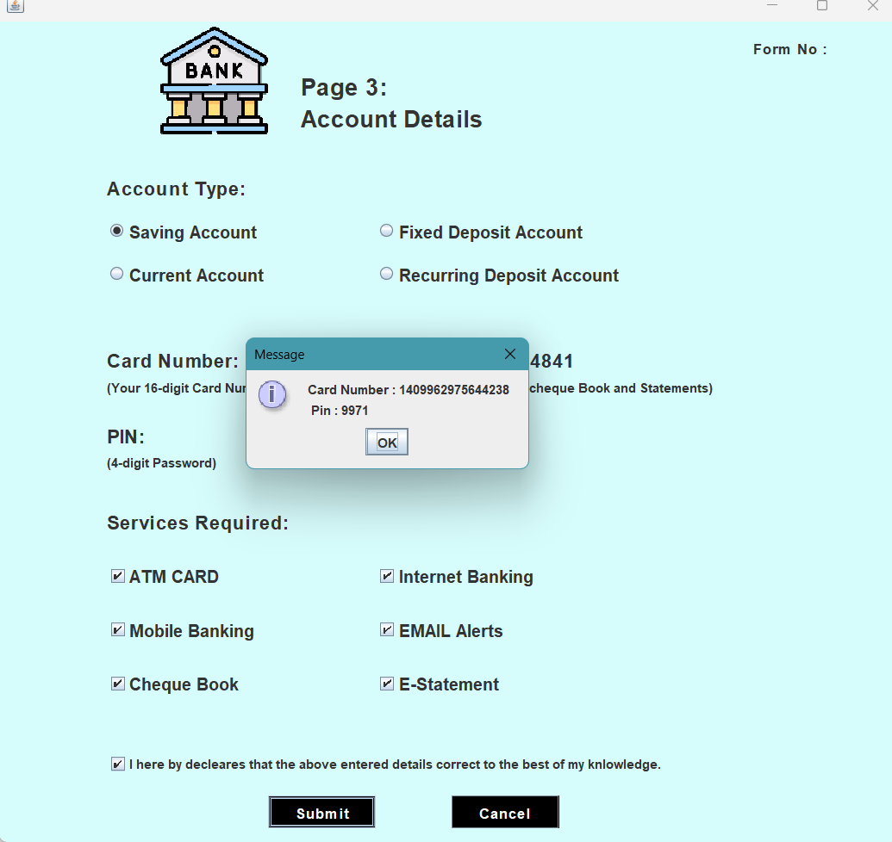

# Bank-Management-System

A simple Bank Management System built in Java with a graphical user interface (GUI). This system allows users to perform a variety of banking operations such as depositing money, withdrawing cash, checking balances, and changing PINs. The system uses a relational database (MySQL) to store and retrieve data securely.

## Features
Deposit: Allows the user to deposit money into their bank account.
Cash Withdrawal: Allows the user to withdraw money from their account.
Fast Cash: Provides a quick way to withdraw predefined amounts.
Balance Enquiry: Displays the current balance of the user’s account.
PIN Change: Lets the user change their PIN after verifying their old one.
Mini Statement: Displays recent transactions (deposits and withdrawals).
User Authentication: Login functionality for secure access to the system.
Graphical User Interface: A user-friendly interface built using Java Swing.
## Technologies Used
Java: Programming language for the core functionality and GUI.
MySQL: Database management system to store user and transaction data.
JDBC (Java Database Connectivity): For connecting the Java application to the MySQL database.
Swing: Java framework for creating the graphical user interface.
HTML: For displaying the mini statement.
## Setup and Installation
Prerequisites
Java 8 or higher: Make sure you have Java installed on your system. You can check if Java is installed by running:
bash
Copy
Edit
java -version
## MySQL: You will need MySQL installed and running. Make sure you create a database to store the user data.
IDE: You can use any Java IDE such as IntelliJ IDEA, Eclipse, or NetBeans to run the project.

### First Interface

  

### Second Interface

  

 ### Third Interface

  

### Fourth Interface

  

### Fifth Interface

  

### Sixth Interface

  

### Seventh Interface

  

